# Agentic Workflow Mermaid Templates
> Source: https://github.com/ThibautMelen/agentic-workflow-patterns
> Extracted: 2026-03-28

---

## Color Legend (used across all diagrams)

| Class | Color | Meaning |
|-------|-------|---------|
| `user` | Indigo `#6366f1` | User / input / output |
| `main` | Purple `#8b5cf6` | Main agent (orchestrator) |
| `subagent` | Pink `#ec4899` | Subagent (worker) |
| `parallel` | Blue `#3b82f6` | Parallel worker (identical clone) |
| `state` | Green `#10b981` | State / success / result |
| `gate` | Amber `#f59e0b` | Gate / checkpoint |
| `exit` | Red `#ef4444` | Exit / failure |
| `data` | Cyan `#06b6d4` | Data / environment |
| `idle` | Slate `#94a3b8` | Idle / inactive handler |

---

## 1. Foundations: Augmented LLM

### 1a. The Augmented LLM (Building Block)

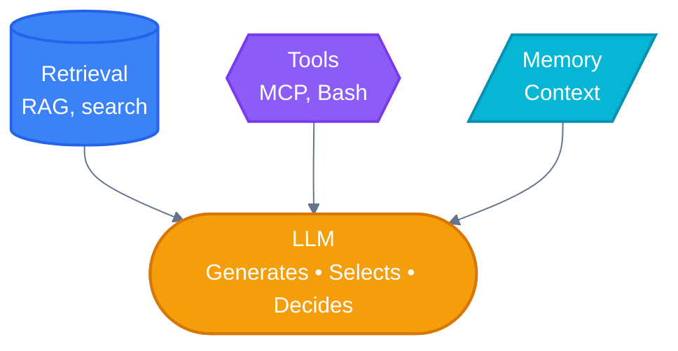

### 1b. Agent Hierarchy (Flat — No Nested Subagents)

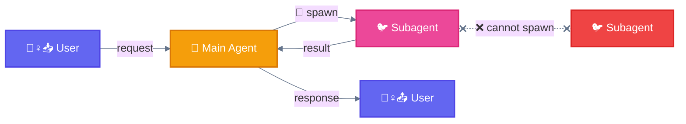

> **Rule:** Subagents CANNOT spawn other subagents (flat hierarchy only)

---

## 2. Baseline (Direct Execution)

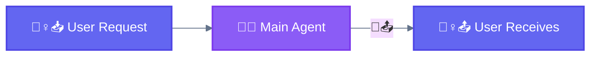

> Single LLM call, no orchestration. Use for simple one-step tasks.

---

## 3. Prompt Chaining

### 3a. Sequential Chain with Gates

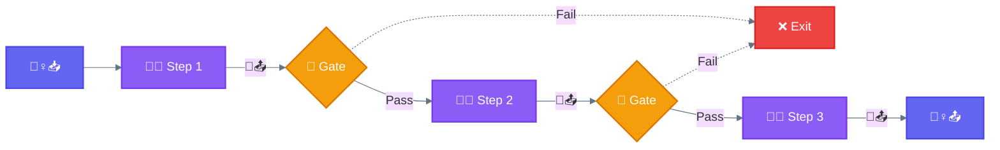

### 3b. Variant — Wizard Workflow (Human Confirmation at Each Phase)

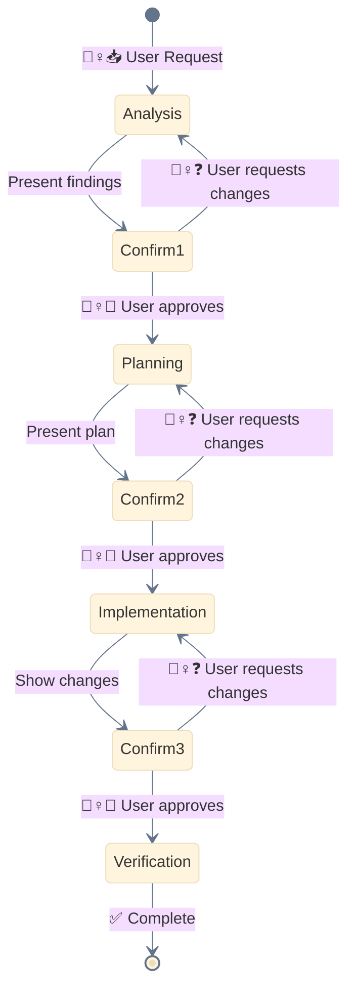

> Use Wizard for destructive operations, complex refactoring, multi-stakeholder decisions.

---

## 4. Routing

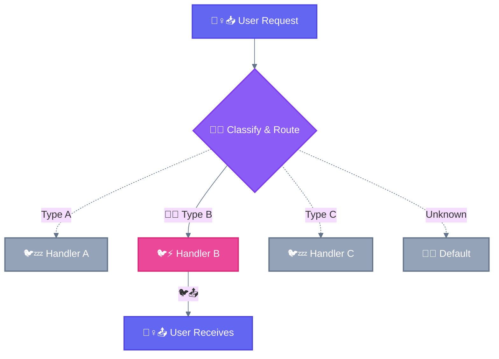

> One input takes ONE track. Use when distinct categories exist and classification is reliable.

---

## 5. Parallelization

### 5a. Core Concept (Split + Merge)

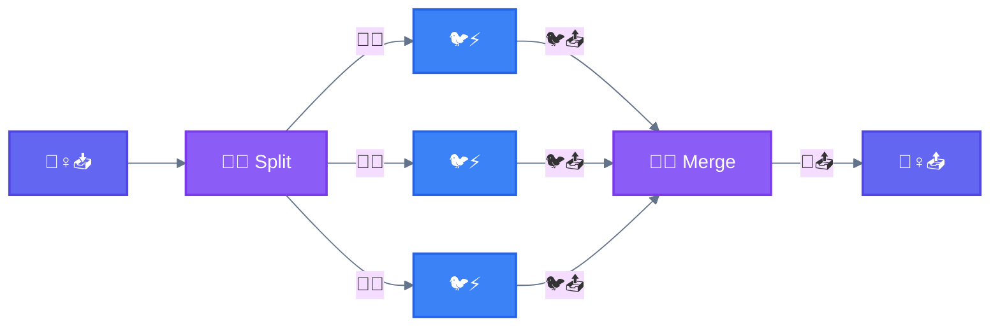

### 5b. Type 1 — Sectioning (Split Data, Combine All)

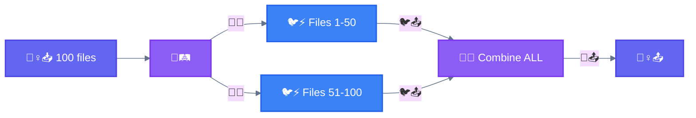

### 5c. Type 2 — Voting (Same Task, Pick Best)

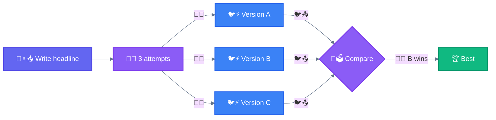

### 5d. Variant — Parallel Tool Calling

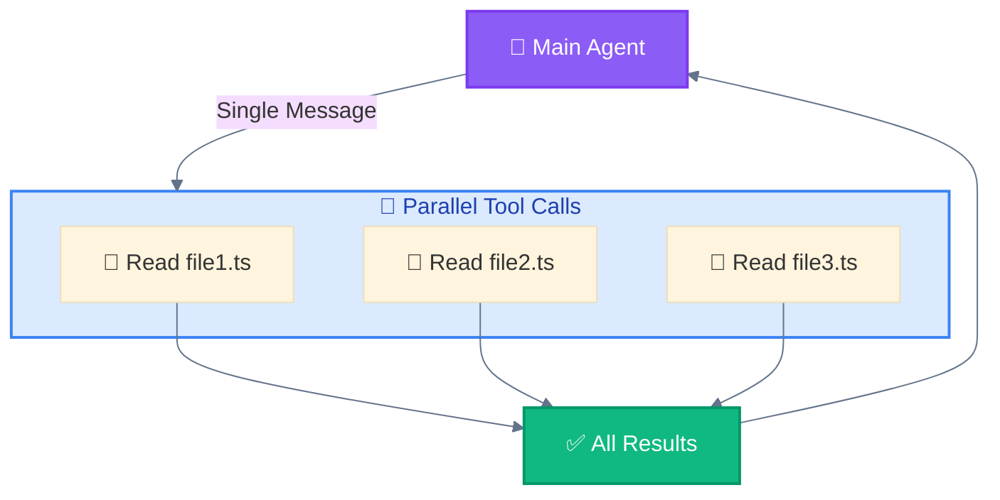

### 5e. Variant — Master-Clone (Isolated Domains)

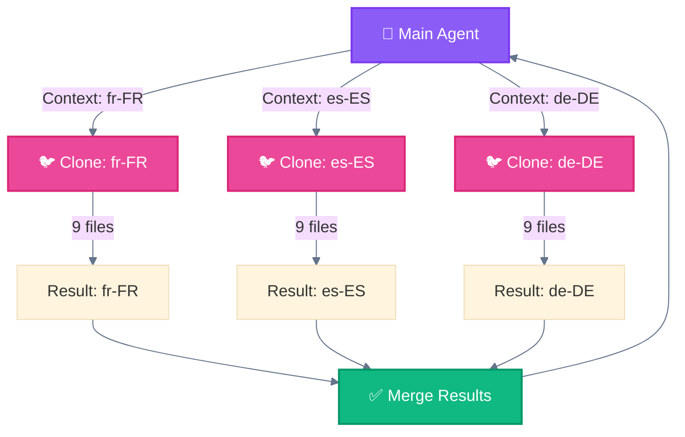

---

## 6. Orchestrator-Workers

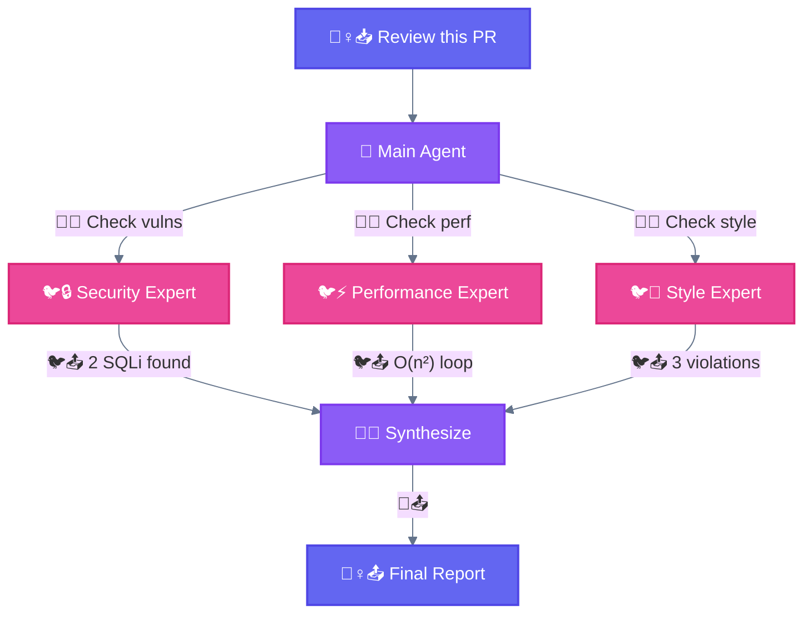

> Different specialists collaborate. Subtasks determined dynamically by the orchestrator.

---

## 7. Evaluator-Optimizer

### 7a. Main Generate-Evaluate Loop

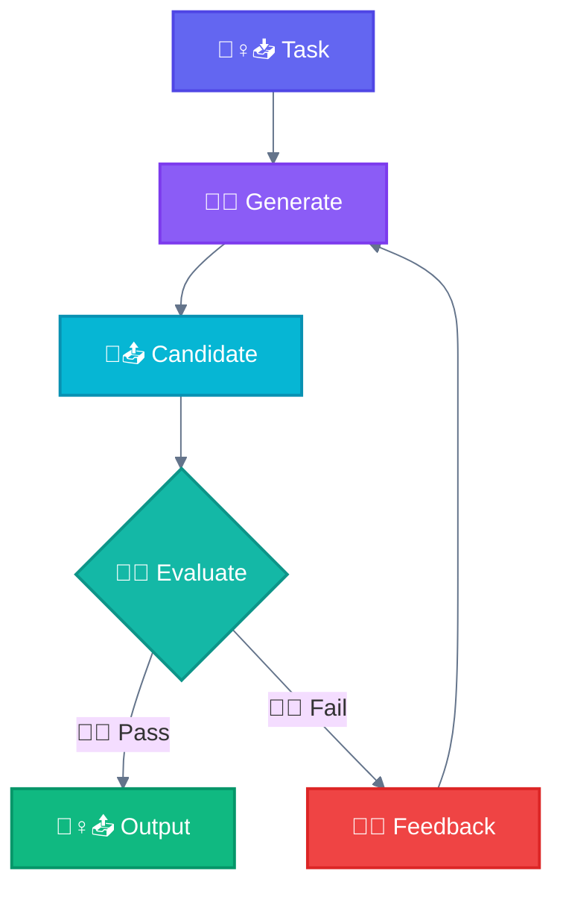

### 7b. Detailed Sequence

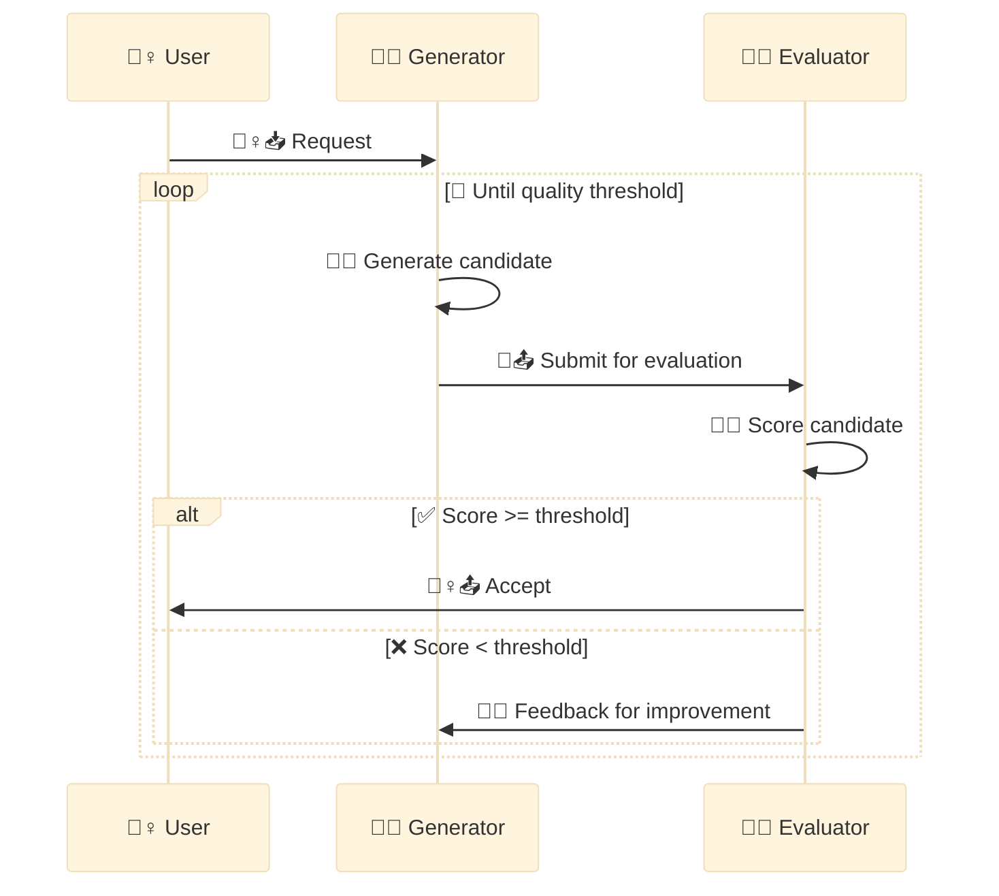

### 7c. Variant — Self-Correction Chain

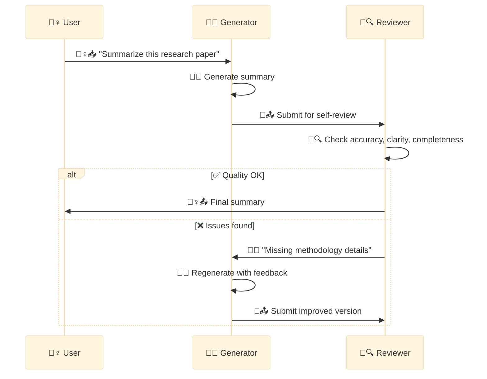

---

## 8. Autonomous Agent

### 8a. Plan-Act-Observe-Reflect Loop

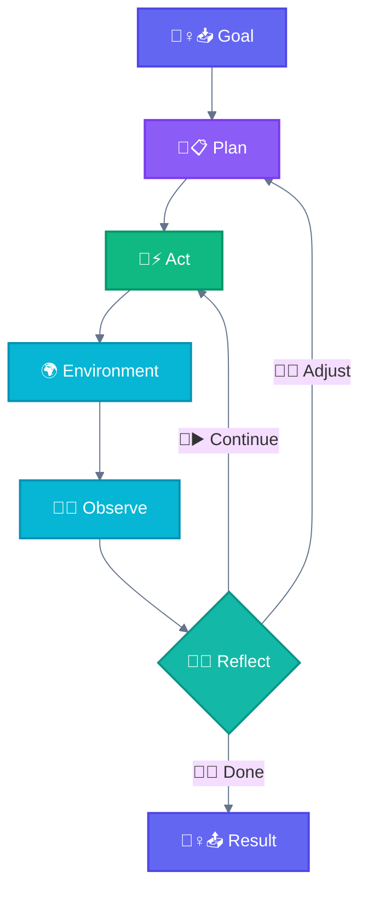

### 8b. Agent Loop State Diagram

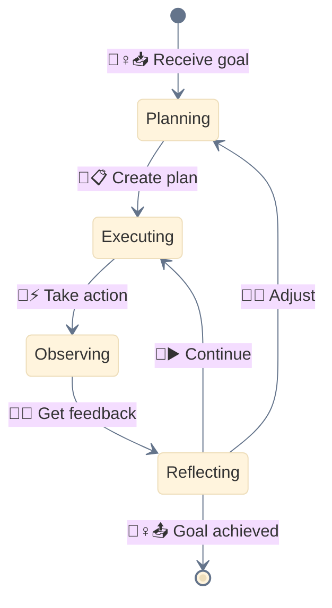

---

## 9. Multi-Window Context (Session Persistence)

### 9a. Cross-Session Resume

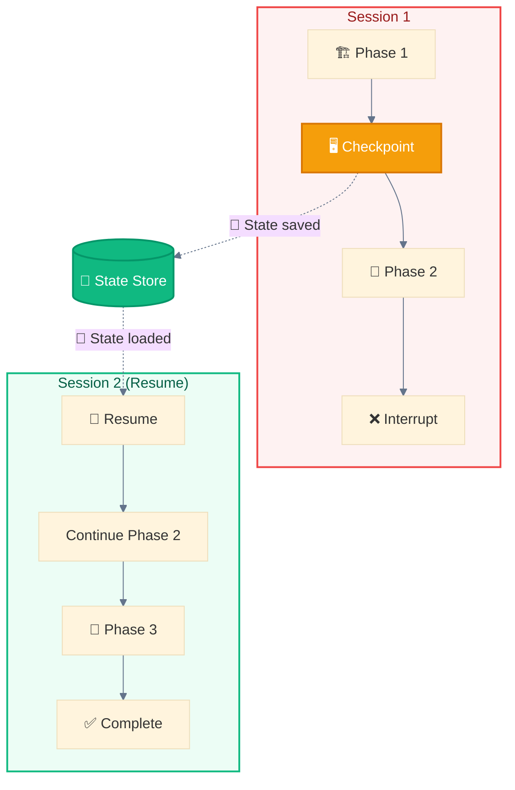

### 9b. Checkpointing for Long Workflows

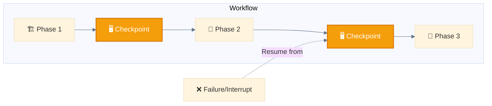

---

## 10. Implementation Components

### 10a. Hook — Pre/Post Execution Intercept

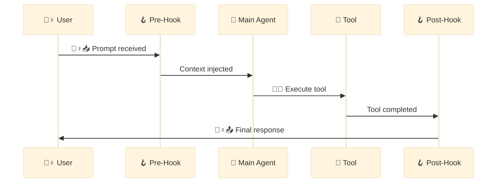

> Hook events: `PreToolUse`, `PostToolUse`, `PermissionRequest`, `UserPromptSubmit`

### 10b. Skill — Dynamic Methodology Injection

```mermaid
%%{init: {'theme': 'base', 'themeVariables': {'lineColor': '#64748b'}}}%%
flowchart TB
    classDef user fill:#6366f1,stroke:#4f46e5,stroke-width:2px,color:#ffffff
    classDef main fill:#8b5cf6,stroke:#7c3aed,stroke-width:2px,color:#ffffff
    classDef skill fill:#8b5cf6,stroke:#7c3aed,stroke-width:2px,color:#ffffff
    classDef decision fill:#f59e0b,stroke:#d97706,stroke-width:2px,color:#ffffff

    REQ["🙋‍♀️📥 User Request"]:::user --> CHECK{"📚 Skill Applicable?"}:::decision
    CHECK -->|Yes| LOAD["📚 Load Skill"]:::skill
    CHECK -->|No| DIRECT["🐔⚡ Direct Execution"]:::main
    LOAD --> APPLY["🐔📚 Apply Methodology"]:::main
    APPLY --> EXEC["🐔⚡ Execute with Skill"]:::main
    EXEC --> RESULT["💁‍♀️📤 Enhanced Result"]
    DIRECT --> RESULT
```

### 10c. Skill — Progressive Matching

```mermaid
%%{init: {'theme': 'base', 'themeVariables': {'lineColor': '#64748b'}}}%%
flowchart TB
    classDef main fill:#8b5cf6,stroke:#7c3aed,stroke-width:2px,color:#ffffff
    classDef skill fill:#8b5cf6,stroke:#7c3aed,stroke-width:2px,color:#ffffff
    classDef decision fill:#f59e0b,stroke:#d97706,stroke-width:2px,color:#ffffff

    REQ["🙋‍♀️📥 User Request"] --> MA["🐔 Main Agent"]:::main
    MA --> CHECK{"📚 Match Skills?"}:::decision

    CHECK -->|TDD Task| TDD["📚 test-driven-development"]:::skill
    CHECK -->|Debug Task| DEBUG["📚 systematic-debugging"]:::skill
    CHECK -->|Review Task| REVIEW["📚 code-review"]:::skill
    CHECK -->|None| DIRECT[Direct Execution]

    TDD --> EXEC["✅ Enhanced Execution"]
    DEBUG --> EXEC
    REVIEW --> EXEC
    DIRECT --> EXEC
```

### 10d. Slash Command — Trigger to Execution

```mermaid
%%{init: {'theme': 'base', 'themeVariables': {'lineColor': '#64748b'}}}%%
flowchart LR
    classDef user fill:#6366f1,stroke:#4f46e5,stroke-width:2px,color:#ffffff
    classDef main fill:#8b5cf6,stroke:#7c3aed,stroke-width:2px,color:#ffffff

    U["🙋‍♀️📥 /generate fr-FR"]:::user --> CMD["🦴 Slash Command"]:::user
    CMD --> MA["🐔💭 Main Agent"]:::main
    MA --> W["Workflow Execution"]
    W --> R["💁‍♀️📤 Result"]
```

### 10e. Subagent — Spawn and Return

```mermaid
%%{init: {'theme': 'base', 'themeVariables': {'lineColor': '#64748b'}}}%%
sequenceDiagram
    participant U as 🙋‍♀️ User
    participant MA as 🐔 Main Agent
    participant SA as 🐦 Subagent
    participant T as 🔧 Tools

    U->>MA: "Review my code"
    MA->>SA: 🪺 Task(subagent_type="code-reviewer")
    SA->>T: Read, Grep, Glob
    T-->>SA: Results
    SA-->>MA: 🐦📤 Review Report
    MA-->>U: 💁‍♀️📤 "Here's the review..."
```

### 10f. Subagent — Resume Across Sessions

```mermaid
%%{init: {'theme': 'base', 'themeVariables': {'lineColor': '#64748b'}}}%%
sequenceDiagram
    participant MA as 🐔 Main Agent
    participant SA as 🐦 Subagent
    participant FS as 💾 File System

    MA->>SA: Task(prompt="Research X")
    SA->>SA: Work on task...
    SA-->>MA: Return result + agentId
    SA->>FS: Save transcript (agent-{id}.jsonl)

    Note over MA,FS: Later...

    MA->>SA: Task(resume="abc123", prompt="Continue with Y")
    FS-->>SA: Load previous transcript
    SA->>SA: Resume with full context
    SA-->>MA: Return continued result
```
