# Graphviz AI Orchestration Diagrams

## Purpose

Generate professional, publication-quality Graphviz DOT diagrams for complex AI pipeline dependency graphs. This skill encodes both DOT syntax AND the domain knowledge of agentic orchestration, multi-model workflows, and dependency-aware sequenced pipelines — optimized for dense graphs with 20+ nodes where Mermaid's auto-layout would struggle.

## Rendering

Graphviz DOT is rendered in:
- **Graphviz CLI** (`dot -Tpng input.dot -o output.png`) — highest quality
- **Graphviz Online** (dreampuf.github.io/GraphvizOnline) — free, browser-based
- **VS Code Graphviz extension** — live preview
- **Kroki.io** — unified diagram rendering API
- **Jupyter notebooks** — via graphviz Python package

Claude generates DOT notation as a code block or saves it as a `.dot` or `.gv` file.

## When to Use Graphviz (vs. Other Diagram Types)

| Use Case | Graphviz? | Why / Why Not |
|---|---|---|
| Dense dependency graph (20+ nodes) | **Yes — primary use** | Best auto-layout engine for complex graphs |
| Multi-pipeline interconnection map | **Yes** | Handles cross-pipeline dependencies elegantly |
| Publication-quality static diagrams | **Yes** | Fine-grained control over every visual element |
| Hierarchical cluster grouping | **Yes** | Subgraph clusters with independent styling |
| Custom node shapes and styling | **Yes** | Unlimited shape, color, font, and layout control |
| Simple 5-10 node DAG | **No** | Use Mermaid — simpler syntax, renders in-thread |
| Human-AI swimlanes | **No** | Use BPMN or PlantUML — better swimlane support |
| Interactive exploration | **No** | Use HTML+JS for zoom/click |
| Sequence / call chains | **No** | Use PlantUML or Mermaid sequence diagrams |

## Domain: AI Pipeline Orchestration Patterns

### Node Attributes for AI Concepts

| AI Concept | DOT Shape | Style | Example |
|---|---|---|---|
| Pipeline / major stage | `box3d` or `Mrecord` | Bold, colored fill | `P1 [shape=box3d, style=filled, fillcolor="#4A90D9"]` |
| Processing step | `box` | Rounded | `step1 [shape=box, style="rounded,filled"]` |
| Decision / gate | `diamond` | Amber fill | `gate1 [shape=diamond, fillcolor="#F5A623"]` |
| Human review | `octagon` | Green fill | `review1 [shape=octagon, fillcolor="#7ED321"]` |
| AI model | `component` | Purple fill | `opus [shape=component, fillcolor="#9B59B6"]` |
| Data store | `cylinder` | Gray fill | `kb [shape=cylinder, fillcolor="#E8E8E8"]` |
| External input | `parallelogram` | Teal fill | `input1 [shape=parallelogram, fillcolor="#1ABC9C"]` |
| Start / end | `circle` / `doublecircle` | — | `start [shape=circle]` |
| Error state | `box` | Red, dashed | `error [shape=box, style="dashed", color="red"]` |

### Edge Attributes

| Relationship | DOT Style | Example |
|---|---|---|
| Deterministic dependency | Solid arrow (default) | `P1 -> P2` |
| Conditional path | Dashed | `P1 -> P2 [style=dashed]` |
| Data flow | Bold/thick | `P1 -> P2 [penwidth=2.0]` |
| Labeled dependency | Label | `P1 -> P2 [label="feeds curriculum map"]` |
| Cross-pipeline signal | Dotted, colored | `P3 -> P7 [style=dotted, color="#E74C3C"]` |
| Feedback / revision loop | Constraint=false | `gate -> P1 [constraint=false, style=dashed]` |

### Cluster (Subgraph) Patterns

Use clusters to group related pipelines or phases:

```dot
subgraph cluster_phase1 {
    label="Phase 1: Foundation"
    style=filled
    fillcolor="#EBF5FB"
    color="#4A90D9"

    P1 [label="P1\nSource Analysis"]
    P2 [label="P2\nCurriculum Architecture"]
}
```

## DOT Syntax Reference

### Complete Pipeline Dependency Graph

```dot
digraph AI_Pipeline_Orchestration {
    // Global settings
    rankdir=LR
    node [fontname="Helvetica", fontsize=11]
    edge [fontname="Helvetica", fontsize=9]
    graph [fontname="Helvetica", fontsize=12, labeljust=l]
    newrank=true
    compound=true
    splines=ortho

    // Node style definitions
    node [shape=box3d, style=filled, fontcolor=white]

    // Phase 1: Foundation
    subgraph cluster_foundation {
        label="Phase 1: Foundation"
        style="rounded,filled"
        fillcolor="#EBF5FB"
        color="#4A90D9"
        fontcolor="#2C5F8A"

        P1 [label="P1\nSource Content\nAnalysis", fillcolor="#4A90D9"]
        P2 [label="P2\nCurriculum\nArchitecture", fillcolor="#4A90D9"]
    }

    // Phase 2: Design
    subgraph cluster_design {
        label="Phase 2: Design"
        style="rounded,filled"
        fillcolor="#F5EEF8"
        color="#9B59B6"
        fontcolor="#7D3C98"

        P3 [label="P3\nInstructional\nDesign", fillcolor="#9B59B6"]
        P5 [label="P5\nAssessment\nDesign", fillcolor="#9B59B6"]
    }

    // Phase 3: Build
    subgraph cluster_build {
        label="Phase 3: Build"
        style="rounded,filled"
        fillcolor="#E8F8F5"
        color="#1ABC9C"
        fontcolor="#0E6655"

        P4 [label="P4\nContent\nGeneration", fillcolor="#1ABC9C"]
        P6 [label="P6\nMultimedia\nIntegration", fillcolor="#1ABC9C"]
    }

    // Phase 4: Assemble
    subgraph cluster_assemble {
        label="Phase 4: Assembly"
        style="rounded,filled"
        fillcolor="#FEF9E7"
        color="#F5A623"
        fontcolor="#D4891A"

        P7 [label="P7\nFinal\nAssembly", fillcolor="#F5A623", fontcolor="#333"]
    }

    // QA Gates
    node [shape=diamond, fillcolor="#F5A623", fontcolor="#333", style=filled]
    QA1 [label="QA\nGate 1"]
    QA2 [label="QA\nGate 2"]
    QA3 [label="QA\nGate 3"]

    // Dependencies
    P1 -> P2
    P2 -> QA1
    QA1 -> P3 [label="pass"]
    P3 -> P5
    P5 -> QA2
    QA2 -> P4 [label="pass"]
    QA2 -> P6 [label="pass"]
    P4 -> QA3
    P6 -> QA3
    QA3 -> P7 [label="pass"]

    // Revision loops
    QA1 -> P1 [style=dashed, color="#E74C3C", constraint=false, label="revise"]
    QA2 -> P3 [style=dashed, color="#E74C3C", constraint=false, label="revise"]
    QA3 -> P4 [style=dashed, color="#E74C3C", constraint=false, label="revise"]
}
```



### Layout Control

| Attribute | Effect | Example |
|---|---|---|
| `rankdir` | Flow direction | `LR` (left-right), `TB` (top-bottom) |
| `rank=same` | Force same horizontal level | `{rank=same; P4; P6}` |
| `constraint=false` | Don't affect layout | For feedback/revision edges |
| `splines` | Edge routing | `ortho` (right-angle), `polyline`, `curved` |
| `compound=true` | Edges between clusters | Required for cluster-to-cluster edges |
| `newrank=true` | Better ranking algorithm | Use for complex graphs |
| `nodesep` | Horizontal spacing | `nodesep=0.8` |
| `ranksep` | Vertical/rank spacing | `ranksep=1.2` |
| `minlen` | Minimum edge length | `P1 -> P2 [minlen=2]` |

### Record Nodes (for detailed step info)

```dot
P1 [shape=record, label="{P1: Source Analysis|{Model: Opus 4.6|Time: ~15min}|{Inputs: PDF, standards|Outputs: content map}}"]
```

## Recommended Color Palette

| Element | Fill | Font | Hex |
|---|---|---|---|
| Pipeline node | `#4A90D9` | White | Blue |
| QA gate | `#F5A623` | Dark | Amber |
| Human step | `#7ED321` | White | Green |
| AI model | `#9B59B6` | White | Purple |
| Data store | `#E8E8E8` | Dark | Gray |
| Error path | `#E74C3C` | White | Red |
| External input | `#1ABC9C` | White | Teal |
| Cluster background | Lightened version of border color | — | — |

## Workflow

1. **Receive description.** User describes the complex pipeline system — nodes, dependencies, phases, gates.
2. **Assess complexity.** If <15 nodes with simple dependencies, suggest Mermaid instead. Graphviz shines at 20+ nodes.
3. **Map to clusters.** Group pipelines by phase, model assignment, or functional area.
4. **Define node styles.** Assign shapes and colors based on the role table above.
5. **Map dependencies.** Solid for deterministic, dashed for conditional, labeled for data flows.
6. **Set layout parameters.** Choose rankdir, splines, spacing for optimal readability.
7. **Generate DOT code.** Produce complete `digraph { ... }` block.
8. **Present as code block** or save as `.dot` / `.gv` file.

## Output Format

Always wrap in a dot fenced block:

````
```dot
digraph Pipeline {
    ...
}
```
````

If saving to file, use `.dot` or `.gv` extension with standard naming:
`[PREFIX_]Graphviz_Description_YYYY-MM-DD_vXX_I.dot`

## Rendering Instructions for User

After generating the DOT code, include:

> **To view this diagram:**
> 1. Go to [Graphviz Online](https://dreampuf.github.io/GraphvizOnline) (free, no account needed)
> 2. Paste the code
> 3. The diagram renders immediately with auto-layout
> 4. For highest quality: install Graphviz locally and run `dot -Tpng file.dot -o output.png`
