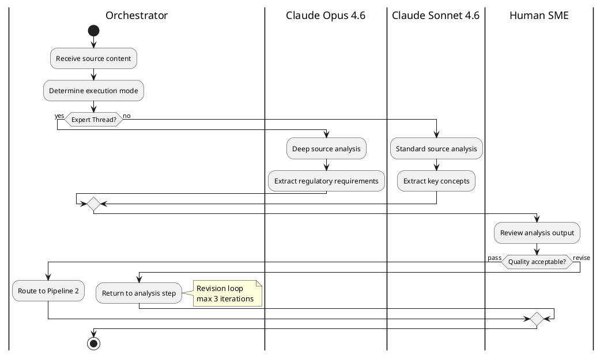
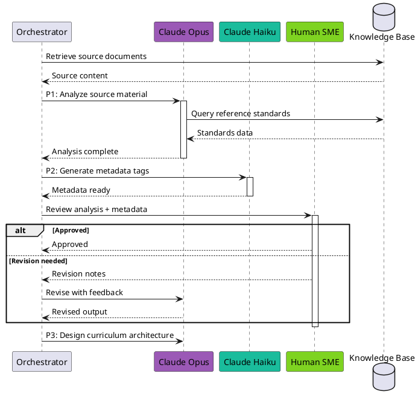
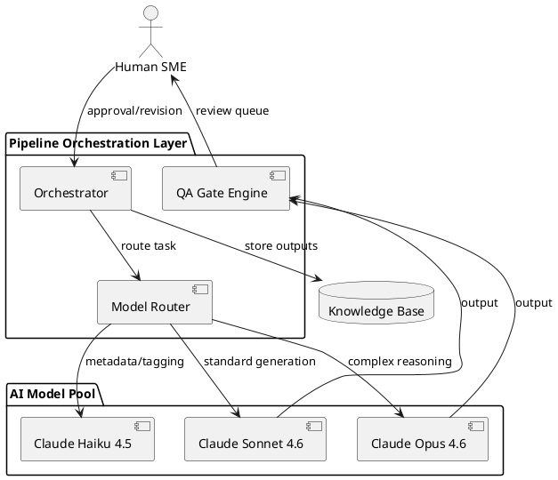

# PlantUML AI Orchestration Diagrams

## Purpose

Generate professional PlantUML diagrams for AI pipeline orchestration. This skill encodes both PlantUML syntax AND the domain knowledge of agentic orchestration, multi-model workflows, and dependency-aware sequenced pipelines — so Claude can produce correct PlantUML from a plain-language description.

## Rendering

PlantUML text is rendered in:
- **plantuml.com** (free, browser-based) — paste text, get diagram
- **VS Code PlantUML extension** (jebbs.plantuml) — live preview
- **PlantUML server** (self-hosted or plantuml.com/plantuml)
- **Confluence, GitLab, Asciidoctor** — native PlantUML support
- **Kroki.io** — unified diagram rendering API

Claude generates PlantUML text as a code block or saves it as a `.puml` file.

## When to Use PlantUML (vs. Other Diagram Types)

| Use Case | PlantUML? | Why / Why Not |
|---|---|---|
| Swimlane activity diagrams | **Yes — primary use** | Best text-based swimlane support |
| Sequence diagrams (model call chains) | **Yes** | Rich sequence notation with participants, notes, groups |
| Activity diagrams with branching | **Yes** | Full if/else, fork/join, repeat support |
| Deployment architecture | **Yes** | Component, deployment, and package diagrams |
| Simple pipeline DAG | **No** | Use Mermaid — faster, renders in GitHub natively |
| Formal enterprise process model | **No** | Use BPMN — ISO standard with richer semantics |
| Interactive exploration | **No** | Use HTML+JS for zoom/click |
| Dense dependency graph (20+ nodes) | **No** | Use Graphviz — better auto-layout for complex graphs *(threshold reconciled 2026-06-10 from a stale "50+" to match the corpus-wide ~15–20 handoff / graphviz 20+ primary range)* |

## Domain: AI Pipeline Orchestration Patterns

### PlantUML Elements Mapped to AI Orchestration

| AI Concept | PlantUML Element | Notation |
|---|---|---|
| Pipeline step | Activity | `:Step name;` |
| Decision / gate | If-else | `if (condition?) then (yes) ... else (no) ... endif` |
| Parallel execution | Fork/join | `fork ... fork again ... end fork` |
| Human review | Activity with stereotype | `:Review output; <<human>>` |
| AI model execution | Activity with stereotype | `:Generate content; <<ai>>` |
| Swimlane / actor | Partition | `|Actor Name|` |
| Data input | Note | `note right: Input: source.pdf` |
| Error / exception | Kill | `kill` or detach |
| Loop / iteration | Repeat | `repeat ... repeat while (condition?)` |
| Pipeline boundary | Group | `group Pipeline N ... end group` |

### Swimlane Architecture

```
|Orchestrator|
:Route task;
|Claude Opus 4.6|
:Analyze source content;
|Human SME|
:Review analysis;
if (Quality pass?) then (yes)
  |Orchestrator|
  :Proceed to next step;
else (no)
  |Claude Opus 4.6|
  :Revise analysis;
endif
```

## Diagram Types

### 1. Activity Diagram with Swimlanes (most common for orchestration)



### 2. Sequence Diagram (for model call chains)



### 3. Component / Deployment Diagram (for system architecture)



## Styling

### Color Coding

```plantuml
skinparam activity {
  BackgroundColor #E8E8E8
  BorderColor #999
}
skinparam partition {
  BackgroundColor<<ai>> #F3E5F5
  BackgroundColor<<human>> #E8F5E9
  BackgroundColor<<orchestrator>> #E3F2FD
}
```

### Stereotypes for Role-Based Styling

```plantuml
skinparam ActivityBackgroundColor<<ai>> #F3E5F5
skinparam ActivityBackgroundColor<<human>> #E8F5E9
skinparam ActivityBackgroundColor<<gate>> #FFF3E0
skinparam ActivityBackgroundColor<<data>> #E0E0E0
```

### Recommended Color Palette

| Element | Background | Border | Use |
|---|---|---|---|
| AI task | `#F3E5F5` (light purple) | `#9B59B6` | Model execution steps |
| Human task | `#E8F5E9` (light green) | `#7ED321` | Review, approval |
| Gate / decision | `#FFF3E0` (light amber) | `#F5A623` | QA gates, routing |
| Orchestrator | `#E3F2FD` (light blue) | `#4A90D9` | Coordination logic |
| Data store | `#E0E0E0` (light gray) | `#999` | Knowledge bases, inputs |
| Error | `#FFEBEE` (light red) | `#E74C3C` | Exception paths |

## Workflow

1. **Receive description.** User describes the AI workflow — actors, steps, decisions, parallel paths.
2. **Select diagram type.** Activity+swimlanes for orchestration flow, sequence for call chains, component for architecture.
3. **Map actors to swimlanes.** Assign each model, human role, and orchestrator to a partition/participant.
4. **Map gates and branches.** Use if/else for decisions, fork/join for parallel, repeat for loops.
5. **Generate PlantUML text.** Produce complete `@startuml ... @enduml` block.
6. **Apply styling.** Add skinparam directives for color coding by role.
7. **Present as code block** or save as `.puml` file.

## Output Format

Always wrap in a plantuml fenced block:

````

````

If saving to file, use `.puml` extension with standard naming:
`[PREFIX_]PlantUML_Description_YYYY-MM-DD_vXX_I.puml`

## Rendering Instructions for User

After generating the PlantUML text, include:

> **To view this diagram:**
> 1. Go to [plantuml.com](http://www.plantuml.com/plantuml/uml) (free, no account needed)
> 2. Paste the code (including `@startuml` and `@enduml`)
> 3. Click "Submit" to render
> 4. Alternatively: install the PlantUML VS Code extension (jebbs.plantuml) for live preview
